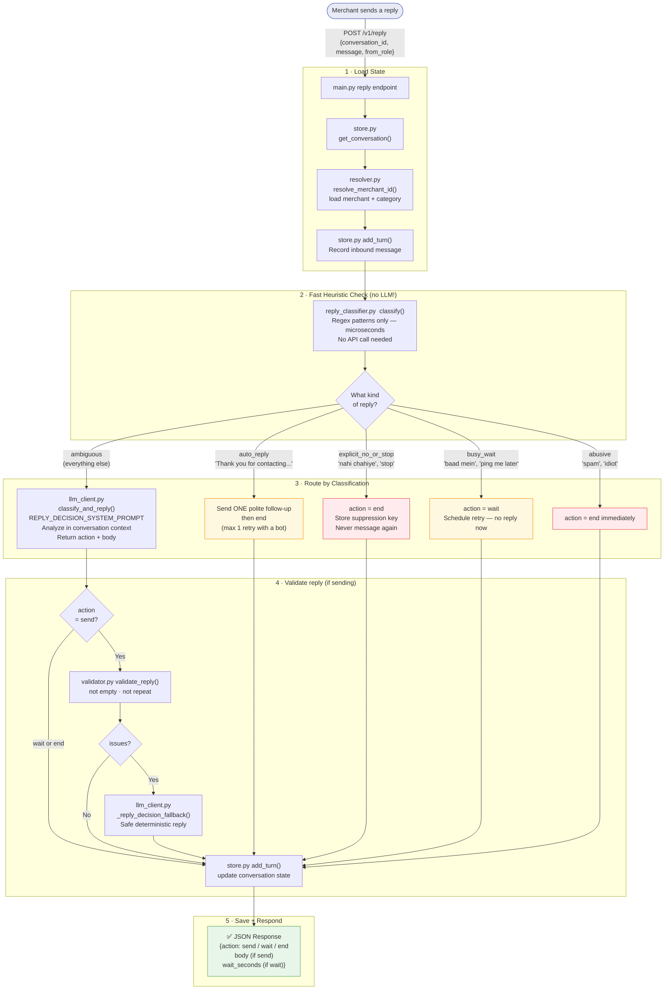
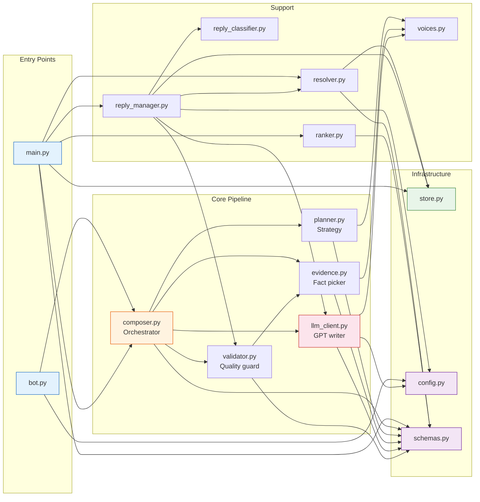
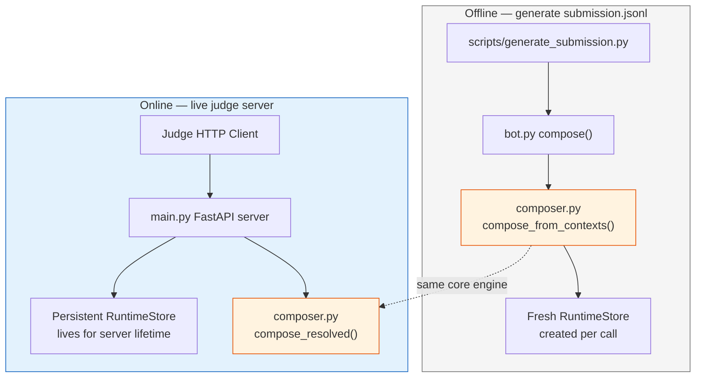
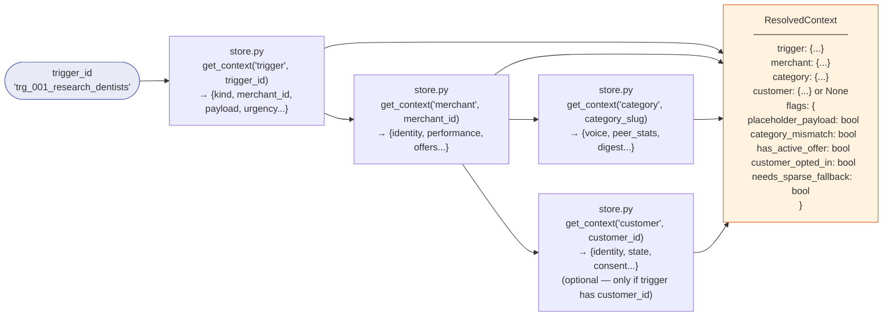

# Code Flow — magicPIN Vera Bot

> **How to read these diagrams**: Each box is a file/module. Arrows show which file calls which. Read top-to-bottom for the main flow, left-to-right for file dependencies.
> These diagrams use **Mermaid** syntax — GitHub, Notion, Obsidian, and VS Code (with the Markdown Preview Mermaid Support extension) all render them automatically.

---

## Diagram 1 — Full Compose Pipeline
> What happens from the moment the judge pushes a trigger to the moment a message is returned.

```mermaid
flowchart TD
    JUDGE([Judge / HTTP Client])

    JUDGE -->|"POST /v1/context\n{scope, version, payload}"| CTX

    subgraph STEP1 ["1 · Store Context"]
        CTX["main.py\npush_context"]
        CTX --> VER{"version\ncheck"}
        VER -->|lower version| REJ["❌ 409 — stale_version"]
        VER -->|same version + same payload| ACC["✅ silent accept\nidempotent replay"]
        VER -->|higher version| STORE["store.py\nContext saved in memory\nkeyed by (scope, id)"]
    end

    JUDGE -->|"POST /v1/tick\n{available_triggers: [ids]}"| TICK

    subgraph STEP2 ["2 · Assemble Context"]
        TICK["main.py\ntick endpoint"]
        TICK --> RES["resolver.py\nresolve_trigger_id()"]
        RES --> FETCH["store.py\nget_context() x4\ntrigger → merchant\n→ category → customer"]
        FETCH --> FLAGS["ResolvedContext + flags\nplaceholder_payload?\ncategory_mismatch?\nhas_active_offer?\ncustomer_opted_in?"]
    end

    subgraph STEP3 ["3 · Rank Priority"]
        FLAGS --> RANK["ranker.py  score()\nurgency + evidence_bonus\n+ scope_bonus - risk_penalty"]
        RANK --> SORT["Triggers sorted\nhighest score first"]
    end

    subgraph STEP4 ["4 · Plan Strategy"]
        SORT --> PLAN["planner.py  build()\nWhich family?\nresearch / event / performance\n/ account / customer_followup\n/ planning / curiosity / fallback"]
        PLAN --> PLANOUT["MessagePlan\nsend_as  cta_type  primary_goal\ntemplate_name  risk_flags"]
    end

    subgraph STEP5 ["5 · Pick Facts"]
        PLANOUT --> EVI["evidence.py  select()\nMax 12 facts\ntrigger → merchant → customer → category\n0.021 humanized → 2.1%"]
        EVI --> FACTS["EvidenceFact list\nOnly these allowed in message"]
    end

    subgraph STEP6 ["6 · Set Tone"]
        FACTS --> VOI["voices.py\nSalutation: Dr. Meera vs Hi Salon!\nLanguage: hi-en mix → Hinglish\nTone: clinical-peer / warm / etc."]
    end

    subgraph STEP7 ["7 · Write with GPT"]
        VOI --> LLM["llm_client.py  draft()\nLangChain + OpenAI\nSystem prompt: be Vera, WhatsApp-native\nUse ONLY approved facts\nFirst sentence = WHY now\nOne CTA at end\nReturns: body + rationale"]
    end

    subgraph STEP8 ["8 · Validate"]
        LLM --> VAL["validator.py  validate()\n✗ empty body\n✗ wrong send_as\n✗ taboo words\n✗ exact repeat of prev message\n✗ numbers NOT in any context = hallucination!"]
        VAL --> ISSUES{"issues\nfound?"}
        ISSUES -->|Yes| FALL["llm_client.py  _fallback()\nDeterministic template\nno GPT — always safe"]
        ISSUES -->|No| COMP
        FALL --> COMP["ComposedMessage\nbody · cta · send_as\nsuppression_key · rationale"]
    end

    subgraph STEP9 ["9 · Save + Respond"]
        COMP --> CONV["store.py\ncreate_conversation()\nSave turn history + suppression key"]
        CONV --> RESP["✅ JSON Response\n{body, cta, send_as,\nsuppression_key, rationale}"]
    end

    style JUDGE fill:#e8eaf6,stroke:#5c6bc0
    style REJ fill:#ffebee,stroke:#e53935
    style FALL fill:#fff8e1,stroke:#fb8c00
    style RESP fill:#e8f5e9,stroke:#43a047
```



---

## Diagram 2 — Reply Flow
> What happens when a merchant (or customer) replies to a Vera message.



---

## Diagram 3 — File Dependency Map
> Which file imports from which. Follow the arrows to see who calls who.



---

## Diagram 4 — bot.py vs the Live API
> Same core engine, two different entry points.



---

## Diagram 5 — The 4-Context Assembly
> How resolver.py builds one ResolvedContext from 4 separate store lookups.



---

## Quick Reference — File Roles

| File | Its one job |
|------|------------|
| `main.py` | Front door — HTTP endpoints, wires all modules together |
| `bot.py` | One-function shortcut for offline compose |
| `store.py` | In-memory filing cabinet — all contexts + conversation history |
| `resolver.py` | Given a trigger ID → assembles all 4 related contexts |
| `ranker.py` | Scores triggers: urgency + evidence − risk |
| `planner.py` | Decides strategy **before** GPT writes anything |
| `evidence.py` | Picks ≤12 verified facts GPT is allowed to use |
| `voices.py` | Salutation, language hint (Hinglish?), tone profile |
| `llm_client.py` | Calls GPT via LangChain; has safe deterministic fallback |
| `validator.py` | Blocks taboo words, hallucinated numbers, and exact repeats |
| `reply_classifier.py` | Fast regex: auto-reply? stop? busy? ambiguous? |
| `reply_manager.py` | Multi-turn conversation orchestrator |
| `composer.py` | Conductor: plan → evidence → draft → validate → return |
| `schemas.py` | Shared data types (ResolvedContext, MessagePlan, etc.) |
| `config.py` | Loads `.env` once and caches it (`@lru_cache`) |

---

## The Golden Path — In One Line

```
Judge pushes context → store.py saves it
Judge fires tick    → resolver assembles 4 contexts
                    → ranker scores priority
                    → planner decides strategy
                    → evidence picks ≤12 facts
                    → voices sets tone + language
                    → llm_client writes with GPT
                    → validator checks for hallucinations/taboo
                    → composer returns ComposedMessage
                    → main.py sends JSON response
```
